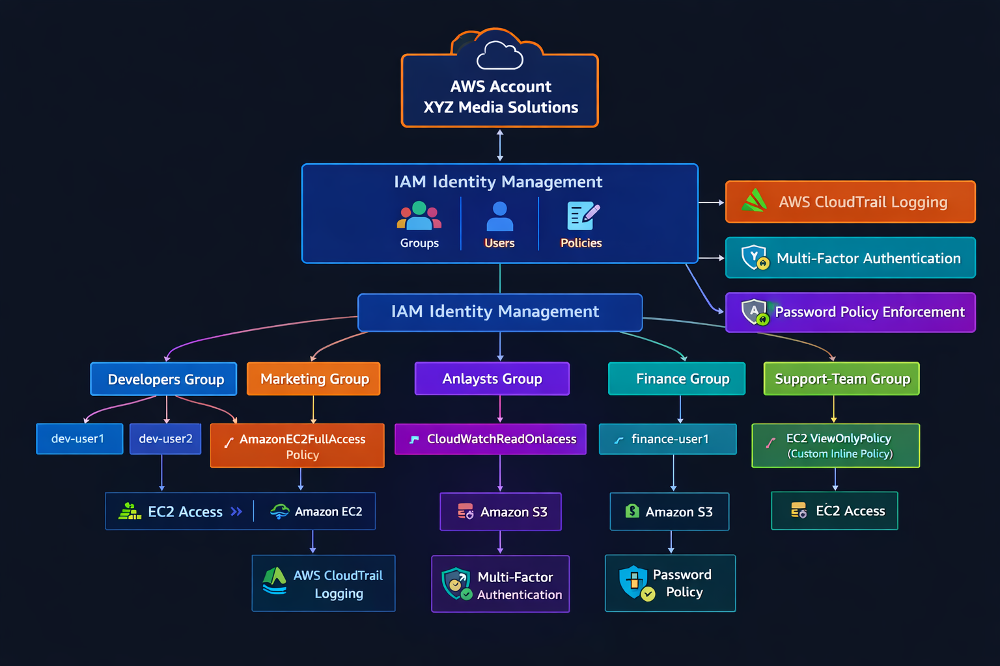

# AWS IAM Secure Setup

## Project Overview

In this project, I built a secure **AWS Identity and Access Management (IAM)** setup for a fictional company called **XYZ Media Solutions**.

The goal was to implement **Role-Based Access Control (RBAC)** and apply the **principle of least privilege**, ensuring that each team only has access to the resources they actually need.

This kind of structure is commonly used in real organizations where multiple teams work within the same AWS account but require controlled access to infrastructure.

---

## Architecture

The IAM structure is organized using **department-based groups**.

Instead of assigning permissions to individual users, permissions are attached to groups. This makes access management easier and more scalable as the organization grows.

The following groups were created:

- Developers
- Marketing
- Analysts
- Finance
- Support Team

Each group receives permissions based on their responsibilities.

## AWS IAM Architecture Diagram



---

## IAM Groups Created

The following IAM groups represent different teams in the organization:

- Developers  
- Marketing  
- Analysts  
- Finance  
- Support Team  

Using IAM groups allows permissions to be managed centrally instead of configuring access for each user individually.

---

## Policies Implemented

### Managed Policy

The **Developers group** was granted the AWS managed policy:

```
AmazonEC2FullAccess
```

This allows developers to launch and manage EC2 infrastructure required for application development.

---

### Custom Inline Policy

The **Support Team** was given limited EC2 visibility through a custom inline policy:

```
ec2:DescribeInstances
ec2:DescribeVolumes
ec2:DescribeSecurityGroups
```

This allows the support team to **view infrastructure details without the ability to modify or launch resources**.

---

## Security Configurations

Additional security controls were implemented to improve account security:

- Multi-Factor Authentication (MFA) enabled for IAM users  
- Strong IAM password policy configured  
- IAM Policy Simulator used to verify permissions  
- AWS CloudTrail enabled for auditing and monitoring activity  

These configurations help strengthen security and provide better visibility into account activity.

---

## Access Testing

After configuring the IAM structure, access was tested using different IAM users to confirm that the **least privilege model** was working correctly.

Results of the tests:

**Developers**  
✔ Able to launch EC2 instances  

**Marketing**  
❌ Denied when attempting to create S3 buckets  

**Support Team**  
✔ Able to view EC2 resources  
❌ Unable to launch EC2 instances  

These tests confirmed that permissions were correctly restricted based on each team's role.

---

## Lessons Learned

Some key takeaways from this project:

- IAM groups make permission management easier when working with multiple teams.
- Testing policies with the **IAM Policy Simulator** helps prevent permission mistakes.
- Following the **principle of least privilege** reduces the risk of accidental infrastructure changes.

---

## Next Project

The next step for the **XYZ Media Solutions infrastructure** is deploying a secure web server using **Amazon EC2**.

This project will include:

- Launching an EC2 instance
- Configuring security groups
- Connecting to the server using SSH
- Installing and configuring a web server
- Hosting a simple web application
