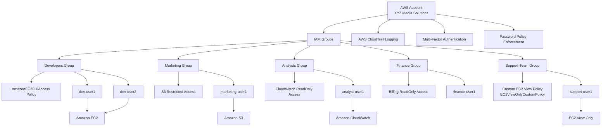

# AWS IAM Secure Setup

## Project Overview

This project demonstrates a secure AWS Identity and Access Management (IAM) architecture designed for a fictional company called **XYZ Media Solutions**.

The objective was to implement **Role-Based Access Control (RBAC)** and enforce the **principle of least privilege** across multiple teams.

---

## Architecture

The IAM architecture contains groups representing different departments.

- Developers
- Marketing
- Analysts
- Finance
- Support Team

Each group receives permissions based on their job responsibilities.

## AWS IAM Architecture Diagram



---

## IAM Groups Created

Developers  
Marketing  
Analysts  
Finance  
Support-Team

These groups simplify permission management across users.

---

## Policies Implemented

### Managed Policy
Developers were granted:

AmazonEC2FullAccess

### Custom Inline Policy

Support team was given limited EC2 visibility using:

```
ec2:DescribeInstances
ec2:DescribeVolumes
ec2:DescribeSecurityGroups
```

This allows infrastructure monitoring without modification.

---

## Security Configurations

• Multi-Factor Authentication (MFA) enabled  
• Strong password policy enforced  
• IAM Policy Simulator used for permission validation  
• AWS CloudTrail enabled for auditing  

---

## Access Testing

Testing confirmed the correct implementation of least privilege.

Developers → able to launch EC2 instances  

Marketing → denied when attempting to create S3 buckets  

Support Team → able to view EC2 resources but unable to launch instances  

---

## Lessons Learned

Implementing IAM groups simplifies permission management.

Testing permissions with IAM Policy Simulator helps prevent security mistakes.

Least privilege reduces the risk of accidental infrastructure changes.

---

---

## Next Project

The next step in the infrastructure build for **XYZ Media Solutions** is deploying a secure web server using Amazon EC2.

This will include:

- Launching an EC2 instance
- Configuring security groups
- Connecting via SSH
- Installing a web server
- Hosting a basic application
